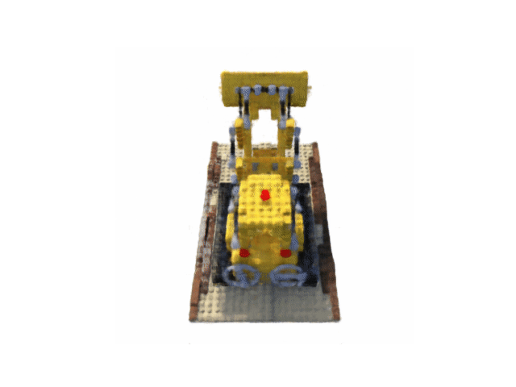

# NeRF
This is a repository for me to play around with NeRF.
I will follow the original paper in

Ben Mildenhall, Pratul P Srinivasan, Matthew Tancik, Jonathan T Barron, Ravi Ramamoorthi, and
Ren Ng. Nerf: Representing scenes as neural radiance fields for view synthesis. Communications
of the ACM, 65(1):99–106, 2021.

and a torch NeRF tutorial:
Lin Yen-Chen. Nerf-pytorch. https://github.com/yenchenlin/nerf-pytorch/,
2020.

# Run the code
To evaluate the trained model, simple call ```python eval.py``` and you will see a render like



and 


You can also run ```python train.py``` and ```python ray_utilis.py``` to see individual result.